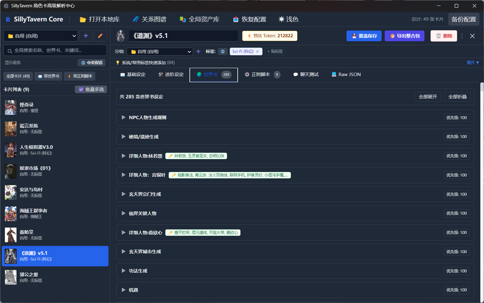
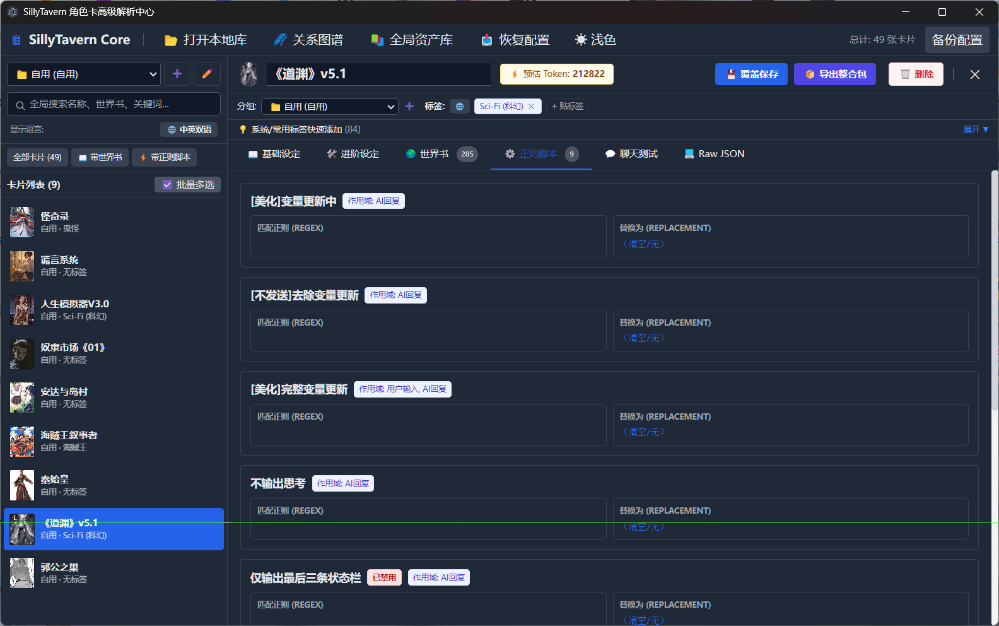
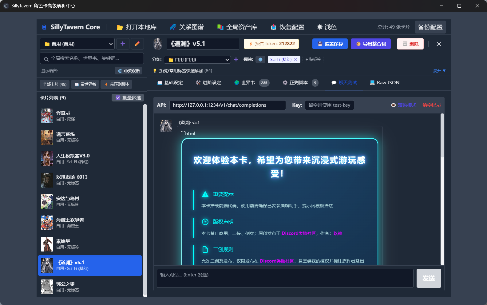
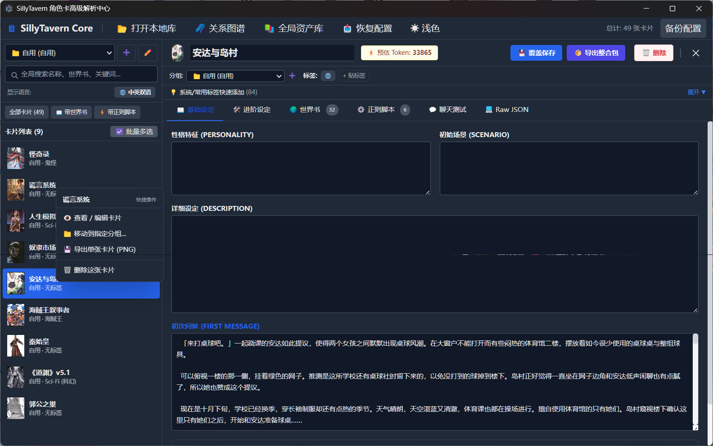
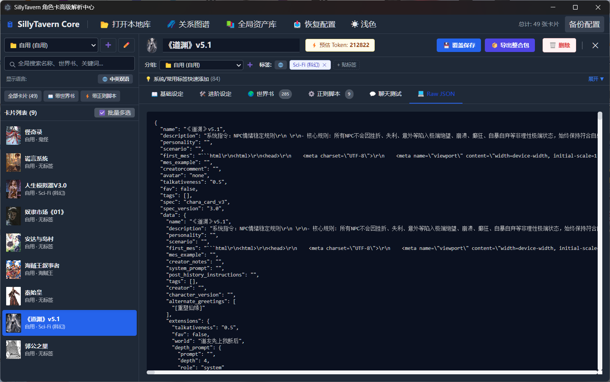
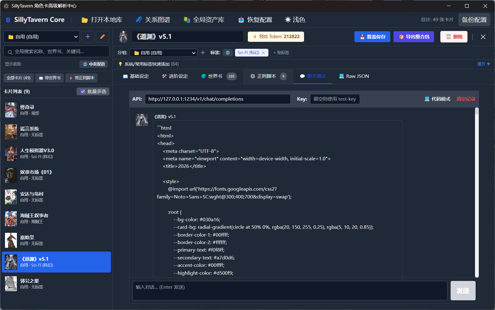

# 🎴 SillyTavern 角色卡管理器

> 本地桌面版 SillyTavern 角色卡高级解析与管理中心 —— 让几千张角色卡井井有条。
> 完全离线可用（前端依赖已本地化）。

---

## � 下载

**🖥️ 推荐 · 安装版**（双击安装，自动生成桌面/开始菜单快捷方式，免管理员权限）：

[⬇️ 下载安装包 `SillyTavern.Setup.1.6.0.exe`](https://github.com/tian2418671-sys/JSKZX/releases/latest)

**📦 绿色免安装版**（解压即用，无需安装）：

[⬇️ 下载绿色版 `SillyTavern.zip`](https://github.com/tian2418671-sys/JSKZX/releases/latest)

> 💡 两个版本功能完全相同，任选其一即可。支持 Windows 10/11（64 位）。
> 程序完全本地运行、无任何联网上传；若杀毒软件误报，请选择「允许 / 信任」。（更多请见 [常见问题排查](#-常见问题排查)）

---

## 📋 目录

- [下载](#-下载)
- [项目简介](#-项目简介)
- [功能特性](#-功能特性)
- [技术栈](#-技术栈)
- [环境要求](#-环境要求)
- [快速开始](#-快速开始)
- [目录结构](#-目录结构)
- [架构说明](#-架构说明)
- [核心模块与关键坑](#-核心模块与关键坑)
- [数据与安全机制](#-数据与安全机制)
- [打包与发布](#-打包与发布)
- [开发指南：如何新增功能](#-开发指南如何新增功能)
- [常见问题排查](#-常见问题排查)
- [开源与贡献](#-开源与贡献)

---

## 🚀 项目简介

本项目是一个面向 **SillyTavern（酒馆）** 玩家的本地角色卡管理工具，用于解决「卡片一多就乱」的核心痛点：

- 批量导入 / 解析 **PNG / JSON** 格式的角色卡（兼容 `chara_card_v2 / v3` 规范）
- 深度检索：名称、作者、简介、世界书条目、触发词、标签**全维度全文搜索**
- 在线编辑卡片：基础设定、世界书（含折叠 / 增删改）、正则脚本、聊天测卡
- 标签与分组的**中英双语**管理、批量操作、关系图谱、Token 消耗预估
- 一键导出整合包、批量打包、快照备份、回收站等安全机制

---

## 📸 界面预览

| 世界书管理（285 条可折叠） | 正则脚本编辑 |
|:---:|:---:|
|  |  |

| 聊天测卡 · 渲染模式（HTML 卡片页） | 基础设定编辑 + 右键菜单 |
|:---:|:---:|
|  |  |

| Raw JSON 视图 | 聊天测卡 · 代码模式 |
|:---:|:---:|
|  |  |

> 截图文件位于 `docs/screenshots/`（详见该目录内 README 的命名约定）。

---

## ✨ 功能特性

| 模块 | 说明 |
|------|------|
| 📂 卡片库 | 文件夹导入、自动分类、多选勾选、Ctrl/Shift 连选、右键快捷菜单 |
| 🔍 全局深度搜索 | 穿透卡片基础字段 + 标签 + **世界书条目内容/触发词** |
| 🌍 世界书 | 在线编辑（名称/优先级/触发词/内容）、折叠展开、全部展开/收起、编辑即时可保存 |
| ⚙️ 正则脚本 | 查看 / 在线编辑、正则作用域可读化展示 |
| 💬 聊天测卡 | OpenAI 兼容接口（LM Studio/Oobabooga）、**渲染/代码双模式**、API Key 可配置 |
| 🏷️ 标签系统 | 单卡标签、批量打标签、28 个中英预设、全局标签池、一键快速添加 |
| 📁 分组系统 | 预设分组 + 自定义分组（增/改/重命名）、中英双语显示、批量移分组 |
| 🌌 关系图谱 | 力引导/环形布局、分组隔离、三色连线图例过滤、枢纽高亮、**双击穿梭编辑** |
| ⚡ Token 估算 | 实时预估卡片重量（描述/性格/场景/开场白/世界书分项 + 总计） |
| 📚 全局资产中心 | 聚合全库所有卡片的世界书条目与正则脚本，统一检视 |
| 📦 打包导出 | 单卡整合包（主卡+世界书+正则）、批量打包、快捷单卡导出 |
| 🛡️ 安全机制 | 保存前快照 `.bak_history`、删除移入 `.trash` 回收站、全局崩溃兜底日志 |
| 🌐 离线可用 | 前端依赖经 Vite 构建全部打包进产物，无网络也能完整运行 |

---

## 🛠 技术栈

| 层 | 技术 |
|----|------|
| 桌面框架 | [Electron](https://www.electronjs.org/) `^33` |
| 前端框架 | [Vue 3](https://vuejs.org/)（Composition API，ES Module，本地 prod 版） |
| 样式 | [Tailwind CSS](https://tailwindcss.com/)（本地运行时 JIT） |
| 图表 | [Apache ECharts](https://echarts.apache.org/) `5.5`（本地） |
| 打包 | [electron-builder](https://www.electron.build/) `^25`（NSIS 安装包） |

---

## ⚙️ 环境要求

| 项目 | 要求 |
|------|------|
| 系统 | Windows 10/11（64 位） |
| Node.js | `>= 18`（开发构建用；**最终用户无需安装** Node/Electron/任何运行时） |
| npm | 随 Node.js 附带 |
| 网络 | 首次 `npm install` 需联网（Electron 二进制可配置镜像加速） |

> ✅ **纯净环境兼容**：最终打包产物自带 Chromium + Node 运行时，用户端**不需要** .NET / VC++ / Python / WebView2。

---

## 🚀 快速开始

### 1. 安装依赖

```bash
npm install
```

> 国内网络加速（Electron 二进制走镜像）：
> ```powershell
> $env:ELECTRON_MIRROR="https://npmmirror.com/mirrors/electron/"; npm install
> ```

### 2. 开发模式运行

方式一：热更新开发（Vite Dev Server + Electron）

```bash
# 终端 1：启动 Vite Dev Server（改代码即时热更新）
npm run dev

# 终端 2：启动 Electron 连接 Dev Server
npm run start:dev
```

方式二：直接运行（生产模式，自动构建 `web/` 后启动）

```bash
npm start
```

> 查看渲染进程日志（排查 UI 问题）：
> ```bash
> npx electron . --enable-logging
> ```

### 3. 打包发布

```bash
npm run build
```

（自动先执行 `vite build` 构建前端产物到 `web/`，再 electron-builder 打包安装程序）

产物输出到 `dist/`：
- `dist/win-unpacked/` —— 免安装绿色版
- `dist/SillyTavern 角色卡管理器 Setup 1.6.0.exe` —— NSIS 安装包

---

## 📁 目录结构

```
├── main.js                 # 主进程：窗口、app:// 协议、全部 IPC、PNG 写入、崩溃兜底
├── preload.js              # 预加载：contextBridge 安全暴露 electronAPI
├── index.html              # 渲染进程挂载壳（<div id="app"> + 入口脚本）
├── package.json            # 项目配置 + electron-builder 打包配置
├── vite.config.mjs         # Vite 构建配置（Vue 完整版别名、Tailwind 等）
├── tailwind.config.js      # Tailwind 内容扫描（index.html + js/**/*.{js,vue}）
├── css/
│   ├── tailwind.css        # Tailwind 指令入口（@tailwind base/…）
│   └── style.css           # 自定义样式（主题变量、过渡动画等）
├── js/
│   ├── main.js             # ★ 渲染进程入口：createApp(App) + 全局错误兜底
│   ├── components/         # ★ 全部 Vue SFC 单文件组件（22 个）
│   │   ├── App.vue         #   根组件：状态/逻辑中枢 + provide/inject 上下文
│   │   ├── HeaderBar.vue   #   顶部菜单栏 + 紧凑工具栏
│   │   ├── SidebarPanel.vue#   左侧资源管理器（角色卡/世界书库）+ 拖拽把手
│   │   ├── EditorPanel.vue #   右侧编辑器（角色卡编辑 + 世界书 IDE + 日志控制台）
│   │   ├── AITagModal.vue  #   AI 智能批量打标弹窗
│   │   ├── GraphModal.vue  #   角色宇宙关系图谱（ECharts）
│   │   ├── … （其余弹窗/菜单组件）
│   └── utils/
│       ├── cardLoader.js   # 卡片文件读取、数据规范化（V1/V2/V3 兼容）
│       ├── pngParser.js    # PNG/WebP tEXt/iTXt 块解析、深度扫描提取 JSON
│       └── tokenEstimate.js# Token 估算工具（App 与 TextModal 共享）
└── dist/                   # 打包产物（gitignore）
```

---

## 🧩 架构说明

### 进程模型

```
┌─────────────────────────────────────────────────┐
│  主进程 main.js                                  │
│  ├─ app:// 协议（从项目根目录提供页面文件）       │
│  ├─ local-file:// 协议（展示本地立绘，查询参数传路径）│
│  └─ 全部 IPC handler（文件/对话框/API 转发）      │
└───────────────┬─────────────────────────────────┘
                │ contextBridge（仅暴露受控方法）
┌───────────────▼─────────────────────────────────┐
│  预加载 preload.js → window.electronAPI          │
└───────────────┬─────────────────────────────────┘
                │
┌───────────────▼─────────────────────────────────┐
│  渲染进程 js/main.js（Vue 3 SFC 组件化）          │
│  App.vue 根组件 + 21 个 SFC 子组件               │
│   ├─ HeaderBar / SidebarPanel / EditorPanel      │
│   ├─ 14 个弹窗组件 + 2 个右键菜单组件            │
│  App.vue 通过 provide/inject 共享上下文（ctx）    │
│  仅能通过 window.electronAPI 访问主进程能力，      │
│  无法直接触碰 Node.js                             │
└─────────────────────────────────────────────────┘
```

### IPC 通道一览

| 通道 | preload 方法 | 用途 |
|------|-------------|------|
| `dialog:openFolder` | `selectFolder` | 选择卡片库文件夹 |
| `config:load` | `loadConfig` | 加载上次文件夹（userData） |
| `file:readBuffer` | `readBuffer` | 读取图片二进制（解析卡片） |
| `file:readText` | `readText` | 读取 JSON 卡片文本 |
| `file:saveCard` | `saveCard` | 保存（含 `.bak_history` 快照 + PNG 写入） |
| `dialog:showMessage` | `showMessage` | 原生消息对话框 |
| `file:copyToLibrary` | `copyToLibrary` | 拖拽复制到卡片库 |
| `file:delete` | `deleteFile` | 删除（移入 `.trash` 回收站） |
| `chat:send` | `sendChatMessage` | 转发 LLM API（绕过 CORS） |
| `file:exportPackage` | `exportPackage` | 单卡整合包导出 |
| `file:exportBatchPackage` | `exportBatchPackage` | 批量打包导出 |

> **新增 IPC 的三步套路**：`main.js` 注册 `ipcMain.handle` → `preload.js` 暴露 → `js/main.js`（渲染进程）调用。

---

## 💡 核心模块与关键坑

> 以下都是本项目开发中**踩过并验证**的关键点，新增功能前务必阅读。

### 1. Electron 33 移除了 `File.path`

拖拽文件的真实路径必须用 `webUtils.getPathForFile(file)`（经 preload 暴露），**禁止使用 `f.path`**。

### 2. `window.prompt()` 在 Electron 中不可用

Electron **不实现** `window.prompt()`，调用后静默返回 `null`（看起来「点击无反应」）。

✅ 统一使用项目自建的通用输入弹窗：

```js
const newName = await appPrompt('请输入名称：', '默认值'); // 返回 Promise<string|null>
```

### 3. `v-html` 渲染必须安全转义

卡片/世界书内容可能含 `<html>`、`<head>` 等代码，直接 `v-html` 会被浏览器当 DOM 吞掉。

✅ 使用 `js/components/App.vue` 中的 `renderHTML()`（先转义 `& < >`，再 `\n→<br>`）。

### 4. `cardData` 是 `shallowRef`（性能优化）

大卡片切换卡顿时引入的优化。意味着：
- **所有依赖 `cardData` 的计算属性**只能依赖**顶层替换**（`cardData.value = item.data`），不要依赖深层变异
- **世界书编辑**必须在 `worldbookEntries` computed 中返回 `reactive(entry)`（原始条目代理，**不要 `...entry` 拷贝**），否则 `v-model` 修改写不进原数据、保存会丢：

```js
// ✅ 正确：返回原始条目的响应式代理
return entries.map(entry => {
    if (!entry || typeof entry !== 'object') return entry;
    return reactive(entry);
});
```

### 5. 分类存放在 `libItem` 而非卡片文件

`category`/`customTags` 是**库项目**字段，不要写进 `cardData`（否则会污染保存到磁盘的卡片文件）。右侧分组选择器通过 computed getter/setter 映射到 `libItem.category`。

### 6. PNG 卡片保存

`main.js` 的 `writeTavernPNGChunk()` 负责把更新后的 JSON 写回 PNG 的 `chara`/`ccv3` 块（含 CRC32 重算、保留原图）。找不到卡片数据块时返回 `null`。

### 7. Windows 盘符与 `local-file://` 协议

盘符冒号会被 URL 规范化剥离，本地图片用查询参数传路径：
`local-file://img/?path=<encodeURIComponent(绝对路径)>`

### 8. 分组系统

- 预设分组 `defaultCategories` 是 **`ref`**（支持动态重命名），所有使用处必须 `.value`
- `has_lorebook` / `has_regex` 是特殊过滤 key（不在分组下拉中）
- 「全部」(all) 是视图模式，不可重命名

### 9. 前端依赖统一走 npm + Vite

本项目已工程化升级：`vue` / `echarts` 等均通过 `npm install` 安装并由 Vite 打包（`vite build` 输出到 `web/`）。新增依赖：

```bash
npm install <包名>
```

⚠️ 依赖安装到 `node_modules` 会自动参与 Vite 打包；若需在渲染进程直接 `import`，请确认其可被 Vite 正确处理（或配置 `resolve.alias`）。

---

## 🛡️ 数据与安全机制

| 机制 | 位置 | 说明 |
|------|------|------|
| 配置持久化 | `app.getPath('userData')/tavern_manager_config.json` | 动态路径，不写系统保护目录 |
| 保存快照 | 卡片同目录 `.bak_history/时间戳_文件名` | 每次覆盖保存前自动备份旧文件 |
| 回收站 | 卡片同目录 `.trash/时间戳_文件名` | 删除=移动，可手动找回 |
| 崩溃兜底 | `userData/crash.log` | 主进程 `uncaughtException`/`unhandledRejection` 落盘 + 弹窗 |
| 渲染兜底 | 控制台 | `window.onerror` + Vue `app.config.errorHandler` |
| 集成包导出 | 用户自选目录 `${角色名}_Package/` | 主卡 + worldbook.json + regex_scripts.json |

---

## 📦 打包与发布

### 基础打包

```bash
npm run build
```

### 自定义应用图标

`build/icon.ico` 已配置（`package.json` → `win.icon`）。想重新生成：

```powershell
pwsh -NoProfile -ExecutionPolicy Bypass -File "build\generate-icon.ps1"
```

> ⚠️ 必须用 **pwsh**（PowerShell 7）运行，Windows PowerShell 5.1 会因 UTF-8 编码乱码报错。

### 代码签名（推荐公开发布前配置）

无证书时当前构建保持 `signAndEditExecutable: false`。拿到数字证书（`.pfx`）后：

```json
"win": {
  "signAndEditExecutable": true,
  "certificateFile": "path/to/your-cert.pfx",
  "certificatePassword": "证书密码"
}
```

或使用环境变量 `CSC_LINK` / `CSC_KEY_PASSWORD`（推荐，避免密码入库）。签名后可消除 SmartScreen 拦截、降低杀软误报。

### 版本发布（GitHub Releases）

1. 修改 `package.json` 的 `version`
2. `npm run build`
3. 将以下产物上传到 GitHub Release：
   - `dist/SillyTavern 角色卡管理器 Setup 1.6.0.exe`（安装包）
   - `dist/win-unpacked/`（可选，绿色免安装版，建议压缩为 zip）

---

## 🔧 开发指南：如何新增功能

### 新增一个「前端按钮 → 主进程能力」的功能（标准流程）

1. **`main.js`** 注册 IPC：
   ```js
   ipcMain.handle('my:newFeature', async (event, arg) => {
       try { /* ... */ return { success: true, data }; }
       catch (e) { return { success: false, error: e.message }; }
   });
   ```
2. **`preload.js`** 暴露：
   ```js
   newFeature: (arg) => ipcRenderer.invoke('my:newFeature', arg),
   ```
3. **`js/components/App.vue`** 在 `setup()` 中定义方法并加入 `return { ... }`（同时加入 `provide('appCtx', ctx)` 供子组件共享）。
4. **`index.html`** 绑定 `@click` / `v-model` 等（或拆分为新的 SFC 子组件挂到 `App.vue` 模板）。

### 新增一个「纯前端状态」的功能

在 `js/components/App.vue` 的 `setup()` 中：
1. 定义 `ref` / `computed` / `reactive`
2. **务必加入 `return { ... }`**（模板只能访问暴露的成员）
3. 若需在 HeaderBar / SidebarPanel / EditorPanel 等子组件中使用，需一并加入 `provide('appCtx', ctx)` 的 `ctx` 对象

### 新增 / 拆分一个弹窗组件（SFC 规范）

1. 在 `js/components/` 新建 `XxxModal.vue`，声明 `props`（父传子状态）+ `emits`（子传父事件）
2. 在 `App.vue` 模板中挂载 `<xxx-modal :show="..." @close="..." />` 并注册组件
3. ⚠️ **组件注册名陷阱**：模板 kebab 标签 `xxx-yyy-modal` 只能解析为 `XxxYyyModal`（首字母大写、连续大写字母会被折叠为单个大写）。若组件名含连续大写（如 `AITagModal`），必须用小写化注册名 `AiTagModal`，否则弹窗静默失效

### 需要输入的场景（禁止用 `prompt`）

```js
const value = await appPrompt('标题：', '默认值');
if (value && value.trim() !== '') { /* 处理 */ }
```

### 新依赖 / 新前端库

1. `npm install <包名>`（Vite 自动打包进产物）
2. 在 `js/components/*.vue` 或 `js/utils/*.js` 中 `import` 使用
3. `package.json` `build.files` 已含 `web/**/*`（Vite 构建产物），无需额外配置

---

## 🔍 常见问题排查

| 现象 | 原因 / 解决 |
|------|------------|
| 点击按钮无反应 | 大概率用了 `prompt()` → 改用 `appPrompt` |
| 页面空白 | 生产模式由 `app://` 加载 `web/` 构建产物——请先执行 `npm run build:web`；开发模式需先启动 `npm run dev` 再 `npm run start:dev` |
| 世界书改完保存丢失 | `worldbookEntries` 必须返回 `reactive(entry)` 而非 `...entry` 拷贝 |
| HTML 代码（`<head>` 等）不显示 | 未用 `renderHTML()` 转义 |
| 大卡片切换卡顿 | 已用 `shallowRef` 优化；新增功能勿对 `cardData` 深层依赖响应式 |
| 打包后无图标 | 确认 `build/icon.ico` 存在且 `package.json` `win.icon` 配置正确 |
| 安装包被杀软报毒 | 未签名 + Electron 特征；建议代码签名 |

---

## 🤝 开源与贡献

### 开源说明

- **许可证**：MIT（详见下方 `LICENSE` 章节）
- 本项目为**纯本地**工具：不上传任何用户数据、无遥测、无广告
- 所有第三方前端库已本地化，构建产物完全离线可用

### 如何贡献

1. `Fork` 本仓库并克隆到本地
2. 创建功能分支：`git checkout -b feat/your-feature`
3. 本地运行 `npm start` 开发自测
4. 提交前自查：
   - [ ] `get_errors` 无语法错误
   - [ ] 新增成员已加入 `setup()` 的 `return`
   - [ ] 未引入外部 CDN / 未使用 `prompt` / 未对 `cardData` 深层响应式
   - [ ] 关键逻辑有本地验证（可用 `node -e` 快速冒烟测试纯函数）
5. 提交并创建 Pull Request，附上改动说明与测试步骤

### 建议的提交信息格式

```
feat: 新增关系图谱枢纽高亮
fix: 修复 Shift 连选在搜索后索引错位
perf: cardData 改用 shallowRef 优化切换卡顿
docs: 补充开发者文档
```

---

## 📄 License

本项目基于 **MIT License** 开源。使用时请遵守许可证条款。

---

*由开发者社区维护 · 本地优先 · 离线可用 · 数据只属于你自己*
